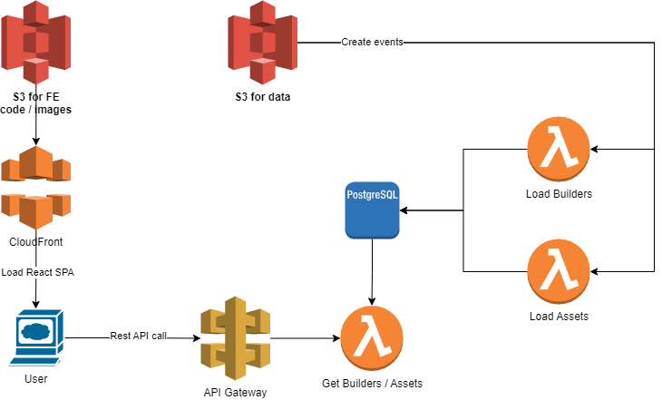

# amakhnev-rbk

## Problem Description
A Housing Association called Meeting Housing Needs (aka MHN) wants to build a module within their Housing
Management Platform to allow them to manage newly built upcoming properties.
There are legal limitations in the ways in which MHN can float the assets for sale based on the contract signed with the
builder. For example, properties bought from Solid Builders Ltd. Prefixed ‘Type 1’ are only meant for first time buyers
starting 1 st of Feb 2024 and properties prefixed ‘Type 2’ are meant for open market starting 1 st of September 2024.
Agreements with Builder partners also have limitations. For example Solid Builders Ltd allow sale for both First Time Buyers
and Open Market, whilst Platinum Building Services allow Open Market sale.

## Task
To create a Front end and Backend application (preferably .NET 6/7/8 or .NET Core), suitably and securely architected and
deployable on AWS or Azure.
The application must be able to determine assets available from a given builder on a given date.
The application should accept the reference data supplied below as text file inputs.
The user will then supply a builder partner name and an effective date as inputs.
The output should describe the assets available as applicable to the builder.
### Submission checklist
Visual Studio solution containing appropriate projects and implementation
### Text File Input #1
Asset Contracts
```csv
Builder|Asset|Market Type|StartDate|EndDate
Solid Builders Ltd|Type 1 Flat|First Time|01/02/2024|
Solid Builders Ltd|Type 1 House|First Time|01/05/2024|
Solid Builders Ltd|Type 2 Flat|Open Market|01/09/2024|
Solid Builders Ltd|Type 2 House|Open Market|01/12/2024|
Platinum Building Services|Flat,House|Open Market|01/01/2025|
```
### Text File Input #2
Builder Partner Contracts
```csv
Builder|Market Type
Solid Builders Ltd|First Time,Open Market
Platinum Building Services|Open Market
```
### AC
Given the supplied above reference data
When user enters 
```
'Solid BuildersI01/10/2024'
```
Then the output is:
```
Builder|Asset|Usage|StartDate|EndDate
Solid Builders Ltd|Type 1 Flat|First Time|01/02/2024|
Solid Builders Ltd|Type 1 House|First Time|01/05/2024|
Solid Builders Ltd|Type 2 Flat|Open Market|01/09/2024|
```


## Solution

The serverless architecture was selected based on several key assumptions about the application's usage patterns and data management needs, which align well with the benefits of a serverless approach:

- Infrequent Data Load: The assumption that new data is loaded infrequently suggests that the system does not require constant running servers. Instead, AWS Lambda functions can be used to process data only when needed, which is more cost-effective than maintaining servers that would be idle most of the time.

- Data Volumes: The expected data volumes, not exceeding hundreds of thousands, indicate that the storage and processing needs are modest. Serverless functions can handle such data volumes efficiently, as they can scale automatically to the demand without pre-provisioning resources.

- Usage Patterns: The application usage is assumed to follow UK working hours, which means there will be peak usage times and potentially long periods of low or no activity.

- Cost-Efficiency and Scalability: Serverless services are designed to automatically scale with the application demand. This means the application can handle the increase in load during peak business hours without any manual intervention, and there is no need to pay for excess capacity during quiet times.


### Architecture


The architecture is structured around two distinct, loosely coupled pathways:

1. ETL Path for Data Loading: This involves the use of AWS S3 for data storage, AWS Lambda functions for executing data processing tasks, and Amazon SNS for event notification. The data is loaded or updated infrequently by various individuals, and when new data is placed in the S3 data bucket, SNS triggers Lambda functions to perform ETL operations, updating the PostgreSQL database accordingly. This decoupled pathway ensures that data management is handled independently of user interactions, providing flexibility and efficiency in data handling.

2. Provisioning Data Process: This process is centered around the user experience and the delivery of data to the frontend. The frontend is a React Single Page Application (SPA) whose static files are hosted on an S3 bucket and distributed via Amazon CloudFront, ensuring fast and reliable access to users. For dynamic data, the backend leverages API Gateway to interface between the frontend and the AWS Lambda functions, which in turn query the PostgreSQL database to retrieve and provision data. This separation of static and dynamic content delivery allows for a highly responsive user interface, with efficient backend data retrieval, fully utilizing the benefits of a serverless backend and a CDN-powered frontend.